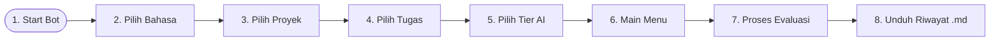

# 📖 Annotator Pro: Panduan Pengguna & Manual Operasional

Selamat datang di Panduan Pengguna Resmi **Annotator Pro Bot**! Panduan ini dirancang untuk membantu Anda, para pelaku anotasi (*annotators*) dan editor konten, dalam mengoperasikan bot ini untuk melakukan evaluasi performa model AI secara cepat, akurat, dan efisien.

---

## 1. Alur Utama Penggunaan Bot

Berikut adalah peta jalan singkat penggunaan bot dari awal hingga Anda berhasil mengunduh hasil evaluasi berkualitas premium:



---

## Bab I: Memulai & Konfigurasi Awal (Getting Started)

Langkah awal ini wajib dilakukan agar bot memahami konteks evaluasi bahasa dan proyek yang sedang Anda kerjakan.

### Langkah 1: Aktivasi Bot
1. Buka obrolan dengan **Annotator Pro Bot** di Telegram.
2. Klik tombol **Start** di bagian bawah obrolan, atau ketik:
   ```text
   /start
   ```
3. Bot akan menyapa Anda secara ramah dan menampilkan informasi saldo awal Anda.


*Ganti dengan tangkapan layar saat bot pertama kali merespons perintah /start.*

---

### Langkah 2: Memilih Bahasa Target (🌐 Langkah 1/5)
Pilihlah bahasa yang menjadi target dari tugas anotasi Anda saat ini. Bot menyediakan 8 pilihan bahasa global:
*   `🇯🇵 Jepang` | `🇹🇭 Thailand`
*   `🇺🇸 Inggris` | `🇮🇩 Indonesia`
*   `🇰🇷 Korea` | `🇻🇳 Vietnam`
*   `🇲🇾 Malaysia` | `🇸🇦 Arab`


*Ganti dengan tangkapan layar inline keyboard pemilihan bahasa.*

---

### Langkah 3: Memilih Proyek Aktif (📂 Langkah 2/5)
Pilihlah nama proyek yang sedang ditugaskan kepada Anda (misalnya: `CHERRY_OPAL`, `MANGO_AMBER`, dll.). 


*Ganti dengan tangkapan layar inline keyboard daftar proyek aktif.*

---

### Langkah 4: Memilih Jenis Tugas (🛠️ Langkah 3/5)
Setiap proyek memiliki kriteria pengerjaan tugas yang unik. Pilih jenis tugas yang ingin Anda evaluasi:
*   `📝 PR (Product Review)` — Evaluasi konten ulasan produk komersial.
*   `🎨 AFM (Ad Creative)` — Evaluasi kualitas slogan, deskripsi, dan daya tarik materi promosi.
*   `🎬 VCG (Video/Creative Generation)` — Evaluasi kecocokan prompt dengan berkas gambar/multimodal.


*Ganti dengan tangkapan layar inline keyboard pilihan task.*

---

### Langkah 5: Memilih Tier Pemrosesan AI (⚡ Langkah 4/5)
Pilih tier kecerdasan buatan yang sesuai dengan saldo atau tingkat ketelitian yang Anda inginkan:
*   **Tier BASIC** (Biaya rendah): Menggunakan model AI standar yang cepat dan efisien.
*   **Tier PREMIUM** (Biaya tinggi): Menggunakan model AI tingkat lanjut dengan analisis bahasa yang sangat sensitif dan mendalam.


*Ganti dengan tangkapan layar pilihan Tier BASIC / PREMIUM.*

---

## Bab II: Mengenal Menu Utama (Main Menu)

Setelah langkah setup 1 sampai 5 selesai, bot akan memunculkan **Dashboard Menu Utama** Anda.


*Ganti dengan tangkapan layar dashboard utama berisi saldo, bahasa aktif, kode proyek, dan jenis tugas.*

### Informasi yang Ditampilkan:
1.  **Status Profil**: Akun terdaftar, bahasa aktif, dan tier saat ini.
2.  **💰 Saldo Poin**: Menunjukkan sisa kredit Anda. Setiap evaluasi sukses akan memotong saldo ini secara adil.
3.  **Tautan Tombol**:
    *   `🚀 Mulai Evaluasi`: Memulai pengisian form kriteria anotasi.
    *   `🔄 Ubah Proyek/Task`: Mengganti konfigurasi bahasa atau tipe evaluasi.
    *   `📑 Riwayat Evaluasi`: Melihat 5 tugas terakhir yang sudah Anda selesaikan.
    *   `💳 Tambah Saldo`: Menampilkan panduan menghubungi admin untuk isi ulang saldo.

---

## Bab III: Menjalankan Alur Evaluasi Model AI (Core Evaluation)

Ini adalah alur kerja inti Anda untuk mengevaluasi kualitas model AI.

### Alur Kerja Evaluasi Teks (e.g. PR, AFM, CYU)

1.  **Memulai Proses**: Klik tombol `🚀 Mulai Evaluasi` dari Menu Utama atau ketik:
    ```text
    /mulai
    ```
2.  **Input Prompt Asli (Original Ask)**: Kirimkan prompt atau instruksi asli yang diberikan pengguna ke model AI.
    *   *Screenshot Placeholder:*
    
    *Ganti dengan tangkapan layar saat bot meminta "Kirimkan Prompt Asli".*

3.  **Input Respons A**: Tempel (*paste*) jawaban pertama yang dihasilkan oleh Model A.
4.  **Input Respons B**: Tempel jawaban kedua yang dihasilkan oleh Model B (opsional, jika tidak ada, klik tombol **"Batal/Skip"** di bawah).
5.  **Input Respons C**: Tempel jawaban ketiga yang dihasilkan oleh Model C (opsional, klik **"Batal/Skip"**).

    *   *Screenshot Placeholder:*
    
    *Ganti dengan tangkapan layar tombol Batal/Skip saat bot meminta respons.*

6.  **Analisis AI Secara Real-Time**:
    Bot akan mengirim pesan `⏳ Sedang diproses oleh AI...`. AI Evaluator akan menganalisis kecocokan tata bahasa, kebenaran informasi, kepatuhan instruksi, dan memberikan kesimpulan model mana yang terbaik.
7.  **Hasil Dikirim**: Bot menyajikan analisis premium lengkap dalam obrolan Anda dan saldo kredit Anda dipotong otomatis.

---

### Alur Kerja Evaluasi Multimodal/Gambar (Tugas VCG)

Tugas ini digunakan untuk mengevaluasi keselarasan antara prompt instruksi dengan file gambar yang dihasilkan.

1.  **Kirim Berkas Gambar**: Saat bot meminta berkas, kirimkan file gambar berformat PNG/JPG ke bot secara langsung.
    *   *Screenshot Placeholder:*
    
    *Ganti dengan tangkapan layar saat Anda mengunggah gambar ke bot.*

2.  **Tulis Deskripsi/Instruksi**: Masukkan prompt gambar asli pada kolom takarir (*caption*) gambar atau kirim sebagai pesan teks setelahnya.
3.  **Dapatkan Analisis Visual**: Bot akan mengekstrak data gambar ke format Base64 dan memprosesnya menggunakan model AI Multimodal terkemuka untuk mencocokkan aspek detail gambar dengan perintah asli.

---

## Bab IV: Cara Melompati & Mengabaikan Kriteria (Skip & Cancel)

Annotator Pro dirancang dengan fleksibilitas tinggi agar tidak menghambat pengerjaan Anda:

*   **Tombol Skip (Lewati)**: Jika data evaluasi Anda hanya membandingkan 2 model (Jawaban A dan Jawaban B) tanpa Jawaban C, Anda cukup menekan tombol `⏭️ Lewati / Skip` pada keyboard Telegram saat bot meminta input Jawaban C.
*   **Membatalkan Sesi**: Jika Anda melakukan kesalahan pengisian, ketik `/cancel` atau tekan tombol `❌ Batal` kapan saja. Sesi evaluasi aktif akan ditutup secara aman tanpa memotong saldo poin Anda sama sekali.


*Ganti dengan tangkapan layar tombol Batal/Skip pada inline keyboard saat percakapan evaluasi aktif.*

---

## Bab V: Mengunduh Dokumen Hasil Evaluasi (.md)

Anda tidak perlu menyalin manual hasil penilaian dari ruang obrolan Telegram ke berkas kerja Anda.

1.  Buka **Dashboard Menu Utama** (ketik `/start`).
2.  Klik tombol `📑 Riwayat Evaluasi` atau langsung ketik:
    ```text
    /history
    ```
3.  Bot akan mengemas 5 riwayat evaluasi terakhir Anda ke dalam satu file dokumen Markdown (`.md`) berkualitas premium dan mengirimkannya langsung sebagai dokumen Telegram yang siap Anda unduh.


*Ganti dengan tangkapan layar saat bot mengirimkan file Markdown .md hasil evaluasi.*

---

## Bab VI: Pemecahan Masalah Mandiri (User Troubleshooting)

Jika Anda menemui kendala teknis saat menggunakan bot, ikuti panduan solusi cepat di bawah ini sebelum menghubungi admin:

### 1. Pesan ❌ "Sistem AI Sedang Sibuk / Kelebihan Beban"
*   **Penyebab**: Server AI eksternal sedang memproses antrean global yang sangat tinggi, atau teks evaluasi yang Anda kirimkan terdeteksi terlalu panjang.
*   **Solusi Mandiri**:
    1.  Tunggu selama 1 hingga 2 menit, lalu coba kirim ulang input Anda.
    2.  Pertimbangkan untuk menghubungi Admin agar tier akun Anda ditingkatkan ke **AI Tier PRO** demi prioritas antrean yang lebih cepat.

### 2. Bot Tidak Merespons Pesan Anda (Stuck)
*   **Penyebab**: State percakapan Anda sedang tersangkut karena salah mengirim jenis format file atau koneksi server berkedip (*flicker*).
*   **Solusi Mandiri**:
    1.  Cukup ketik perintah global reset ini:
        ```text
        /start
        ```
    2.  Bot akan secara otomatis menghapus state corrupt lama Anda dan memandu Anda masuk kembali ke Menu Utama secara bersih. Saldo Anda dipastikan **aman dan tidak terpotong**.

### 3. Saldo Berkurang Meskipun AI Gagal Merespons
*   **Penyebab**: Hal ini tidak mungkin terjadi secara sistemik karena bot diprogram dengan mekanisme *Refund Pasca Evaluasi*. Saldo Anda hanya dikurangi *setelah* berkas analisis AI sukses disajikan ke layar obrolan Anda. Jika Anda merasa ada kejanggalan, klik `💳 Tambah Saldo` di Menu Utama untuk mengirim pesan komplain langsung ke Admin.
